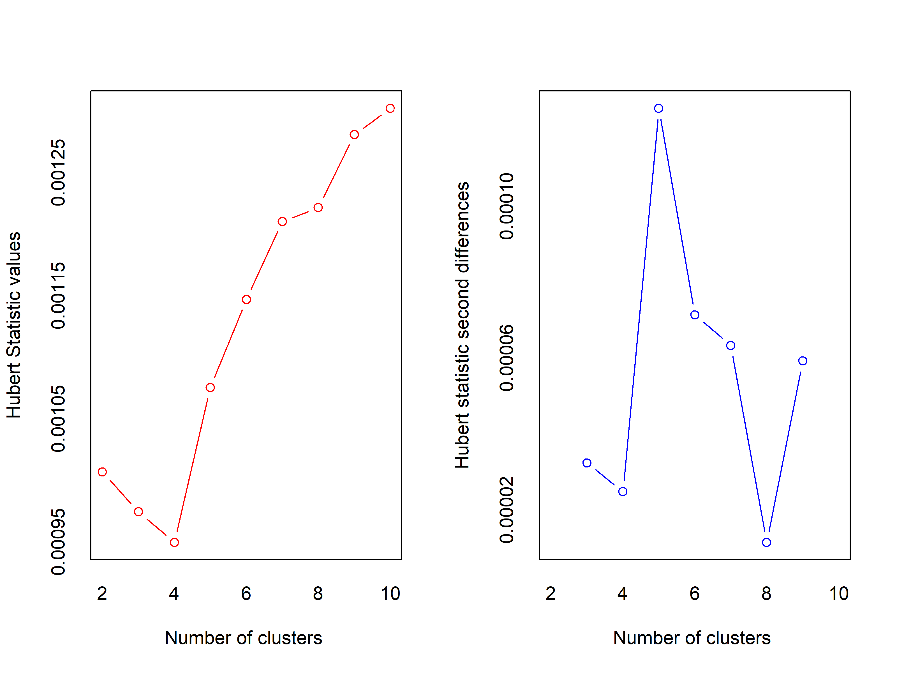
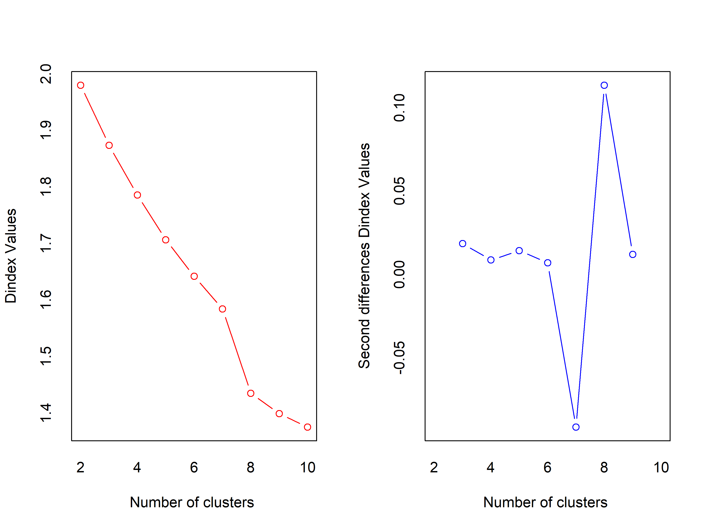
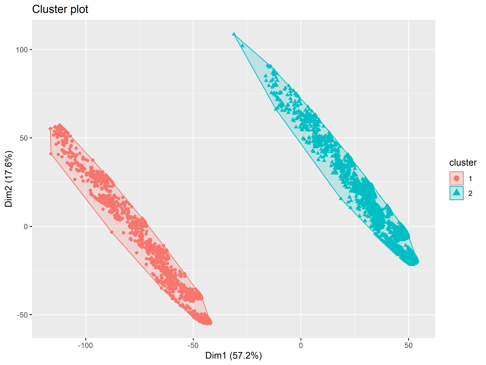

Advanced Clustering
================
Adam Shelton
11/11/2019

## Import Data

``` r
original_data = read_csv(here("Data", "compressed_okcupid.csv"))
```

    ## Warning: Missing column names filled in: 'X1' [1]

    ## Parsed with column specification:
    ## cols(
    ##   X1 = col_double(),
    ##   age = col_double(),
    ##   body_type = col_character(),
    ##   education = col_character(),
    ##   essay0 = col_character(),
    ##   essay9 = col_character(),
    ##   ethnicity = col_character(),
    ##   height = col_double(),
    ##   edu = col_character(),
    ##   fit = col_character(),
    ##   race_ethnicity = col_character(),
    ##   height_group = col_character(),
    ##   long_words = col_double(),
    ##   flesch = col_double()
    ## )

``` r
new_features = read_csv(here("Data", "newfeatures.csv")) %>% select(-X1) %>% as.matrix() %>% scale()
```

    ## Warning: Missing column names filled in: 'X1' [1]

    ## Parsed with column specification:
    ## cols(
    ##   .default = col_double()
    ## )

    ## See spec(...) for full column specifications.

``` r
cluster_data = original_data #%>% select(c("age", "body_type", "diet", "drinks", "drugs", "education", "ethnicity", "job", "orientation", "religion", "sex", "smokes", "status", "sign_import", "dogs", "cats", "kids", "multi_ling", "days_since_online", "distance")) %>% select(-c(cats, dogs)) %>%  mutate_if(is.character, factor) %>% filter(distance < 50) %>% select(-distance) 
```

<!--
## Imputing Data


# Take 1

## PCA


## CLARA


## DBSCAN


# Take 2
-->

## Descriptive Statistics

``` r
skim_list = original_data %>% skim() %>% partition()

skim_list$numeric %>% kable()
```

| skim\_variable | n\_missing | complete\_rate |         mean |           sd |      p0 |          p25 |          p50 |       p75 |  p100 | hist  |
| :------------- | ---------: | -------------: | -----------: | -----------: | ------: | -----------: | -----------: | --------: | ----: | :---- |
| X1             |          0 |              1 | 29725.559450 | 17242.921552 |    0.00 | 14987.000000 | 29548.000000 | 44305.000 | 60550 | ▇▇▇▇▇ |
| age            |          0 |              1 |    32.020657 |     9.088597 |   18.00 |    26.000000 |    30.000000 |    36.000 |    69 | ▇▇▂▁▁ |
| height         |          0 |              1 |    70.507036 |     3.035048 |    3.00 |    69.000000 |    70.000000 |    72.000 |    95 | ▁▁▁▇▁ |
| long\_words    |          0 |              1 |    11.322819 |    13.282247 |    0.00 |     3.000000 |     8.000000 |    15.000 |   446 | ▇▁▁▁▁ |
| flesch         |          0 |              1 |     7.282737 |     4.784808 | \-15.59 |     4.853526 |     6.726154 |     8.955 |   268 | ▇▁▁▁▁ |

``` r
skim_list$character%>% kable()
```

| skim\_variable  | n\_missing | complete\_rate | min |   max | empty | n\_unique | whitespace |
| :-------------- | ---------: | -------------: | --: | ----: | ----: | --------: | ---------: |
| body\_type      |          0 |              1 |   3 |    14 |     0 |        12 |          0 |
| education       |          0 |              1 |  10 |    33 |     0 |        32 |          0 |
| essay0          |          0 |              1 |   1 | 16943 |     0 |     18814 |          0 |
| essay9          |          0 |              1 |   1 | 10849 |     0 |     18252 |          0 |
| ethnicity       |          0 |              1 |   5 |   103 |     0 |       151 |          0 |
| edu             |          0 |              1 |   7 |    21 |     0 |         3 |          0 |
| fit             |          0 |              1 |   3 |     7 |     0 |         3 |          0 |
| race\_ethnicity |          0 |              1 |   5 |     8 |     0 |         6 |          0 |
| height\_group   |          0 |              1 |   5 |     9 |     0 |         2 |          0 |

``` r
original_data %>% select(-essay0, -essay9) %>% mutate_if(is.character, factor) %>% mutate_all(as.numeric) %>% cor(use = "pairwise.complete.obs") %>% ggcorrplot()
```

<!-- -->

``` r
clusterability = original_data %>% select(-essay0, -essay9) %>% mutate_if(is.character, factor) %>% mutate_all(as.numeric) %>% sample_n(5000) %>% get_clust_tendency(n = 50)
clusterability$hopkins_stat
```

    ## [1] 0.7702142

``` r
clusterability$plot
```

<!-- -->

## PCA

``` r
sampled_data = original_data %>% sample_n(2000) 
sampled_data %>% select(-essay0, -essay9) %>% mutate_if(is.character, factor) %>% mutate_all(as.numeric) %>% PCA(graph = FALSE) %>% fviz_pca_biplot(label = "var", col.var = "red", col.ind = "grey")
```

<!-- -->

``` r
ggsave2(here("Clustering", "pca_v2.png"), height = 7, width = 11)
```

<!--## PAM

-->

## Agglomerative Nesting

``` r
agnes_data = sampled_data %>% select(-essay0, -essay9) %>% mutate_if(is.character, factor) %>% mutate_all(as.numeric) %>% mutate_all(scale) 
agnes_diss = agnes_data %>% as.matrix() %>% daisy(metric = "gower")
```

    ## Warning in daisy(., metric = "gower"): binary variable(s) 10 treated as interval
    ## scaled

``` r
nb_results = NbClust(data = agnes_data, diss = agnes_diss, distance = NULL, min.nc = 2, max.nc = 10, method = "ward.D2")
```

    ## Warning in log(det(P)/det(W)): NaNs produced

    ## Warning in log(det(P)/det(W)): NaNs produced
    
    ## Warning in log(det(P)/det(W)): NaNs produced
    
    ## Warning in log(det(P)/det(W)): NaNs produced
    
    ## Warning in log(det(P)/det(W)): NaNs produced
    
    ## Warning in log(det(P)/det(W)): NaNs produced
    
    ## Warning in log(det(P)/det(W)): NaNs produced
    
    ## Warning in log(det(P)/det(W)): NaNs produced
    
    ## Warning in log(det(P)/det(W)): NaNs produced
    
    ## Warning in log(det(P)/det(W)): NaNs produced
    
    ## Warning in log(det(P)/det(W)): NaNs produced
    
    ## Warning in log(det(P)/det(W)): NaNs produced
    
    ## Warning in log(det(P)/det(W)): NaNs produced
    
    ## Warning in log(det(P)/det(W)): NaNs produced
    
    ## Warning in log(det(P)/det(W)): NaNs produced
    
    ## Warning in log(det(P)/det(W)): NaNs produced
    
    ## Warning in log(det(P)/det(W)): NaNs produced
    
    ## Warning in log(det(P)/det(W)): NaNs produced
    
    ## Warning in log(det(P)/det(W)): NaNs produced
    
    ## Warning in log(det(P)/det(W)): NaNs produced
    
    ## Warning in log(det(P)/det(W)): NaNs produced
    
    ## Warning in log(det(P)/det(W)): NaNs produced
    
    ## Warning in log(det(P)/det(W)): NaNs produced
    
    ## Warning in log(det(P)/det(W)): NaNs produced
    
    ## Warning in log(det(P)/det(W)): NaNs produced
    
    ## Warning in log(det(P)/det(W)): NaNs produced
    
    ## Warning in log(det(P)/det(W)): NaNs produced
    
    ## Warning in log(det(P)/det(W)): NaNs produced
    
    ## Warning in log(det(P)/det(W)): NaNs produced
    
    ## Warning in log(det(P)/det(W)): NaNs produced
    
    ## Warning in log(det(P)/det(W)): NaNs produced
    
    ## Warning in log(det(P)/det(W)): NaNs produced
    
    ## Warning in log(det(P)/det(W)): NaNs produced
    
    ## Warning in log(det(P)/det(W)): NaNs produced
    
    ## Warning in log(det(P)/det(W)): NaNs produced
    
    ## Warning in log(det(P)/det(W)): NaNs produced
    
    ## Warning in log(det(P)/det(W)): NaNs produced
    
    ## Warning in log(det(P)/det(W)): NaNs produced
    
    ## Warning in log(det(P)/det(W)): NaNs produced
    
    ## Warning in log(det(P)/det(W)): NaNs produced
    
    ## Warning in log(det(P)/det(W)): NaNs produced
    
    ## Warning in log(det(P)/det(W)): NaNs produced
    
    ## Warning in log(det(P)/det(W)): NaNs produced
    
    ## Warning in log(det(P)/det(W)): NaNs produced
    
    ## Warning in log(det(P)/det(W)): NaNs produced
    
    ## Warning in log(det(P)/det(W)): NaNs produced
    
    ## Warning in log(det(P)/det(W)): NaNs produced
    
    ## Warning in log(det(P)/det(W)): NaNs produced
    
    ## Warning in log(det(P)/det(W)): NaNs produced

<!-- -->

    ## *** : The Hubert index is a graphical method of determining the number of clusters.
    ##                 In the plot of Hubert index, we seek a significant knee that corresponds to a 
    ##                 significant increase of the value of the measure i.e the significant peak in Hubert
    ##                 index second differences plot. 
    ## 

<!-- -->

    ## *** : The D index is a graphical method of determining the number of clusters. 
    ##                 In the plot of D index, we seek a significant knee (the significant peak in Dindex
    ##                 second differences plot) that corresponds to a significant increase of the value of
    ##                 the measure. 
    ##  
    ## ******************************************************************* 
    ## * Among all indices:                                                
    ## * 4 proposed 2 as the best number of clusters 
    ## * 7 proposed 3 as the best number of clusters 
    ## * 3 proposed 4 as the best number of clusters 
    ## * 5 proposed 6 as the best number of clusters 
    ## * 1 proposed 7 as the best number of clusters 
    ## * 1 proposed 8 as the best number of clusters 
    ## * 1 proposed 9 as the best number of clusters 
    ## * 1 proposed 10 as the best number of clusters 
    ## 
    ##                    ***** Conclusion *****                            
    ##  
    ## * According to the majority rule, the best number of clusters is  3 
    ##  
    ##  
    ## *******************************************************************

``` r
fviz_nbclust(nb_results)
```

    ## Among all indices: 
    ## ===================
    ## * 2 proposed  0 as the best number of clusters
    ## * 1 proposed  1 as the best number of clusters
    ## * 4 proposed  2 as the best number of clusters
    ## * 7 proposed  3 as the best number of clusters
    ## * 3 proposed  4 as the best number of clusters
    ## * 5 proposed  6 as the best number of clusters
    ## * 1 proposed  7 as the best number of clusters
    ## * 1 proposed  8 as the best number of clusters
    ## * 1 proposed  9 as the best number of clusters
    ## * 1 proposed  10 as the best number of clusters
    ## 
    ## Conclusion
    ## =========================
    ## * According to the majority rule, the best number of clusters is  3 .

<!-- -->

``` r
agnes_mod = agnes_diss %>% hcut(isdiss = TRUE, k = 3, hc_func = "agnes", hc_method = "ward.D2")
fviz_dend(agnes_mod)
```

<!-- -->

``` r
sampled_data$cluster = agnes_mod$cluster
fviz_cluster(agnes_mod, data = agnes_diss, labelsize = 0)
```

<!-- -->

``` r
saveRDS(sampled_data, here("Data", "Results", "agnes_results.rds"))
write_csv(sampled_data, here("Data", "Results", "agnes_results.csv"))
```
